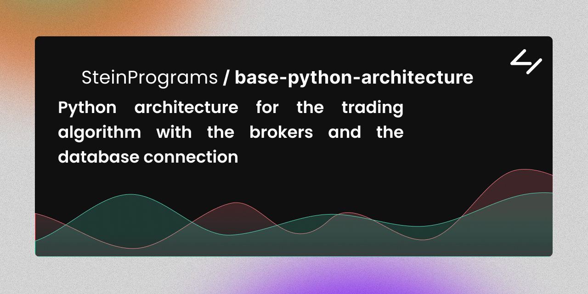
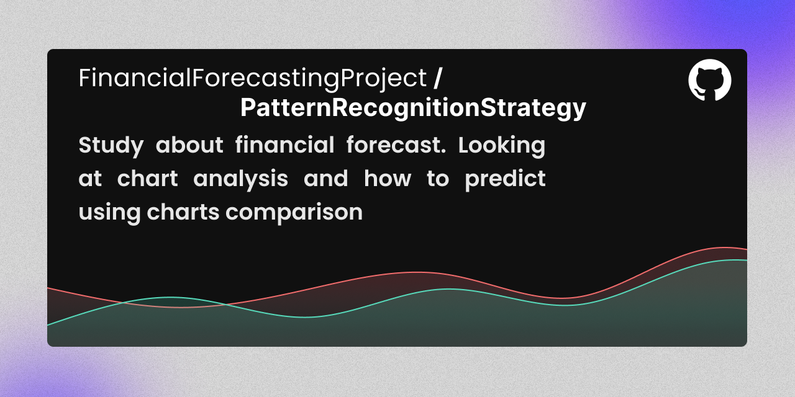
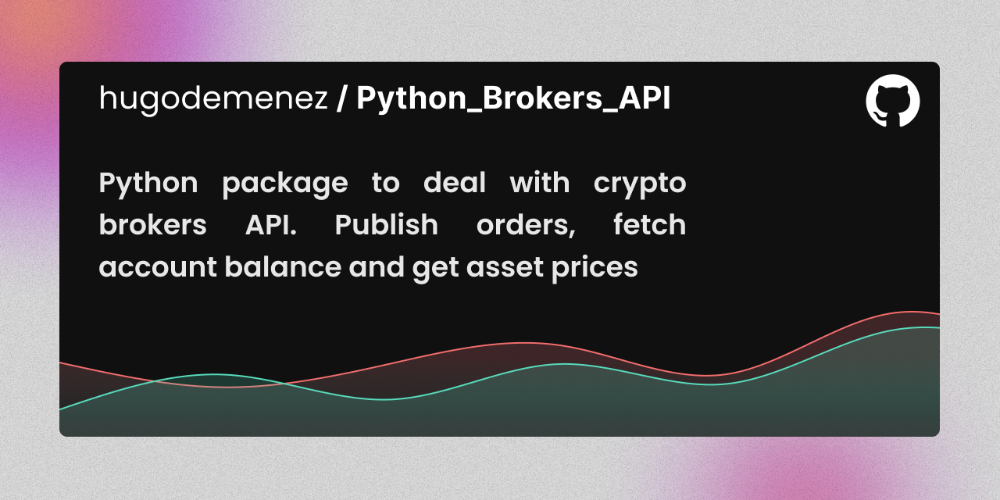

# Welcome 
[](https://spotify-github-profile.vercel.app/api/view?uid=11124908899&redirect=true)

<picture>
  <source 
   media="(prefers-color-scheme: dark)" 
   srcset="https://spotify-github-profile.vercel.app/api/view?uid=11124908899&cover_image=false&theme=default&show_offline=true&background_color=000000&interchange=true&bar_color=ff9300&bar_color_cover=true">
  
</picture>

## Who am I?

Hey there! 

My focus shifts between stock markets and a secret workshop where I'm crafting extraordinary and affordable innovations. 

I am building something that really drives me :
Picture a fusion of technology and design, culminating in a mysterious machine. 
Its mission? To transform the taste of meat through an enchanting aging process, promising a culinary adventure like no other.

## Main activities

### Industrial product journey
* 🚀 3D Modeling a reactive dry aging appliance and filing patent for an incredible dry-aging process

> Dive into budget-friendly gourmet at home with the help of machine learning and computer vision. Enjoy the extraordinary flavors of dry-aged meat, cheese, wine, and sausages—all effortlessly tailored by the appliance.

### Finance and investing project
* 📊 Developping a mathematical analysis method to predict market trends with machine learning tools

> I'm using my studies to create tools that make investing safer and more profitable. These tools automatically adjust strategies based on market sentiment, providing a reliable way to navigate and succeed in the ever-changing market landscape.

## My coding experience

### Extensive use of `python` 

* Machine Learning (Regression, decision tree and classification)
* API (using [FastAPI](https://fastapi.tiangolo.com))
* Large Language Model (Prompt templating, `langchain`)
* Data Analytics

### Learning things

* `Rust` to build blazingly fast softwares
* `Solidity` conceiving automated contracts

### Enjoying other stuff

* coding in good vanilla `HTML`, `CSS` and `JavaScript` 
* JavaScript frameworks like NextJS and Astro

## Active repositories

|[](https://github.com/SteinPrograms/base-python-architecture)|[](https://github.com/FinancialForecastingProject/PatternRecognitionStrategy.git)|
| ------------- | ------------- |
|[](https://github.com/hugodemenez/Python_Brokers_API)|[](https://github.com/hugodemenez/steinprograms-website)|

## My Stats

<!--START_SECTION:waka-->
📅 **I'm Most Productive on Tuesday** 

```text
Monday                   451 commits         ███░░░░░░░░░░░░░░░░░░░░░░   13.01 % 
Tuesday                  639 commits         █████░░░░░░░░░░░░░░░░░░░░   18.44 % 
Wednesday                534 commits         ████░░░░░░░░░░░░░░░░░░░░░   15.41 % 
Thursday                 517 commits         ████░░░░░░░░░░░░░░░░░░░░░   14.92 % 
Friday                   606 commits         ████░░░░░░░░░░░░░░░░░░░░░   17.48 % 
Saturday                 309 commits         ██░░░░░░░░░░░░░░░░░░░░░░░   08.92 % 
Sunday                   410 commits         ███░░░░░░░░░░░░░░░░░░░░░░   11.83 % 
```


📊 **This Week I Spent My Time On** 

```text
💬 Programming Languages: 
MDX                      2 hrs 19 mins       ███████████░░░░░░░░░░░░░░   45.40 % 
Markdown                 1 hr 4 mins         █████░░░░░░░░░░░░░░░░░░░░   20.89 % 
Git                      24 mins             ██░░░░░░░░░░░░░░░░░░░░░░░   07.99 % 
conf                     20 mins             ██░░░░░░░░░░░░░░░░░░░░░░░   06.79 % 
Lua                      16 mins             █░░░░░░░░░░░░░░░░░░░░░░░░   05.21 % 
```


 Last Updated on 28/11/2023 00:48:49 UTC
<!--END_SECTION:waka-->


