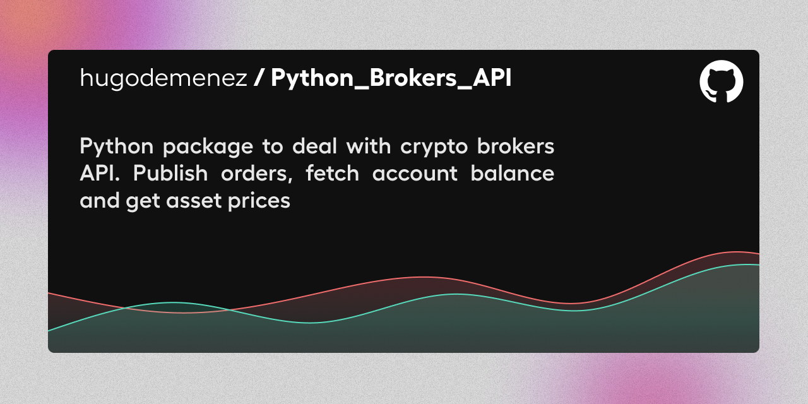

# Welcome 

## Who am I ?

:man_student: Studying quantitative and corporative finance alongside informatics expecting to graduate with an engineering degree

*  I mainly work on algorithms developped with python, but I am also enthousiast about :
    * :man_technologist: WEB : HTML+CSS, JavaScript
    * :iphone: Android : Java using maven
    * :computer: Microsoft : C# and C++

## My current activity

* :rocket: Deploying trading automation on DEX

* :chart: Developping a mathematical analysis method to predict market with machine learning tools and learning about Neural Networks analysis.

## Old activity

## My Stats

## Contact

