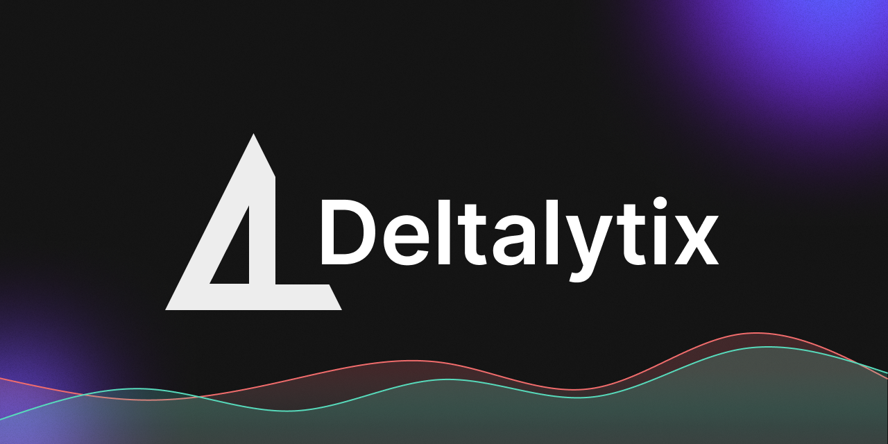

## Active repositories
|||
| ------------- | ------------- |
|[](https://github.com/hugodemenez/deltalytix)|[](https://github.com/SteinPrograms/base-python-architecture)|
|[](https://github.com/FinancialForecastingProject/PatternRecognitionStrategy.git)|[](https://github.com/hugodemenez/Python_Brokers_API)|
|[](https://github.com/hugodemenez/steinprograms-website)|[](https://github.com/hugodemenez/textual-analysis)|


## My Stats

<!--START_SECTION:waka-->
📅 **I'm Most Productive on Wednesday** 

```text
Monday                   546 commits         ███░░░░░░░░░░░░░░░░░░░░░░   13.51 % 
Tuesday                  690 commits         ████░░░░░░░░░░░░░░░░░░░░░   17.07 % 
Wednesday                714 commits         ████░░░░░░░░░░░░░░░░░░░░░   17.66 % 
Thursday                 584 commits         ████░░░░░░░░░░░░░░░░░░░░░   14.45 % 
Friday                   604 commits         ████░░░░░░░░░░░░░░░░░░░░░   14.94 % 
Saturday                 509 commits         ███░░░░░░░░░░░░░░░░░░░░░░   12.59 % 
Sunday                   395 commits         ██░░░░░░░░░░░░░░░░░░░░░░░   09.77 % 
```


📊 **This Week I Spent My Time On** 

```text
💬 Programming Languages: 
TypeScript               3 hrs 8 mins        █████████████████████████   98.68 % 
Bash                     0 secs              ░░░░░░░░░░░░░░░░░░░░░░░░░   00.45 % 
Python                   0 secs              ░░░░░░░░░░░░░░░░░░░░░░░░░   00.39 % 
Prisma                   0 secs              ░░░░░░░░░░░░░░░░░░░░░░░░░   00.23 % 
CSV                      0 secs              ░░░░░░░░░░░░░░░░░░░░░░░░░   00.22 % 
```


 Last Updated on 24/02/2025 01:04:16 UTC
<!--END_SECTION:waka-->


