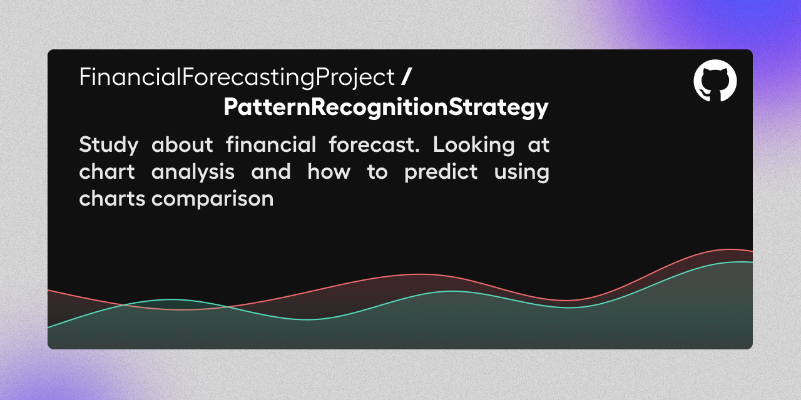

# Welcome 


## Who am I ?

:man_student: Studying quantitative and corporative finance alongside informatics expecting to graduate with an engineering degree

*  I mainly work on algorithms developped with **python**, but I am also enthousiast about :
    * :man_technologist: WEB : HTML+CSS, JavaScript
    * :iphone: Android : Java using maven
    * :computer: Microsoft : C# and C++

## My current activity

* :rocket: Deploying trading automation on DEX

* :chart: Developping a mathematical analysis method to predict market with machine learning tools and learning about Neural Networks analysis.

## Old activity

| Useful one | Best practice|
| ------------- | ------------- |
| [](https://github.com/hugodemenez/Python_Brokers_API)  | [](https://github.com/FinancialForecastingProject/PatternRecognitionStrategy.git)  |

## My Stats

<p align=center>

</p>

<!--START_SECTION:waka-->
📊 **This Week I Spent My Time On** 

```text
💬 Programming Languages: 
CSS                      1 hr 29 mins        ████████████████░░░░░░░░░   66.15% 
HTML                     27 mins             █████░░░░░░░░░░░░░░░░░░░░   20.67% 
TypeScript               15 mins             ██░░░░░░░░░░░░░░░░░░░░░░░   11.14% 
JavaScript               2 mins              ░░░░░░░░░░░░░░░░░░░░░░░░░   2.04%

```


 Last Updated on 01/02/2023 01:03:09 UTC
<!--END_SECTION:waka-->

## Contact

<p align=center >
<a href="https://www.linkedin.com/in/hugo-demenez/"></a>
</p>
