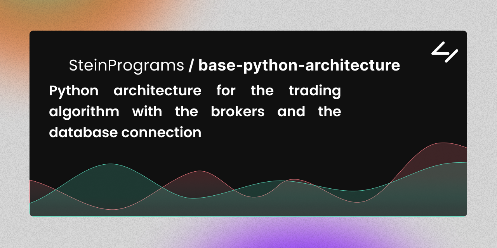
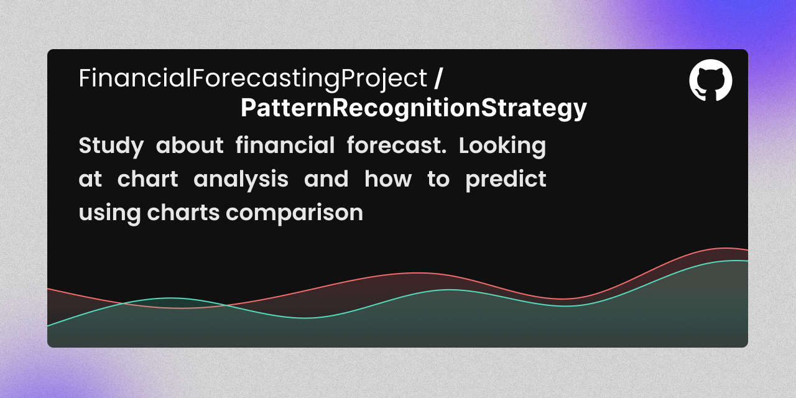
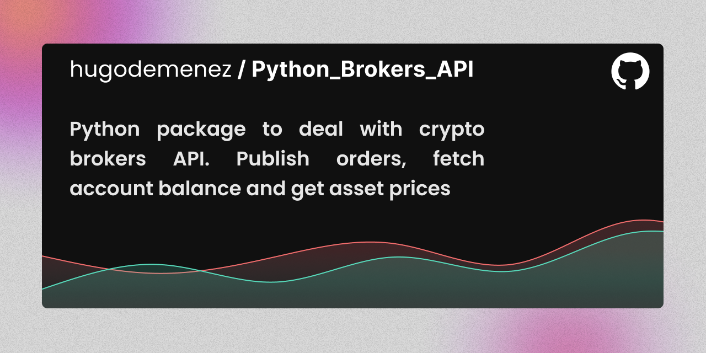
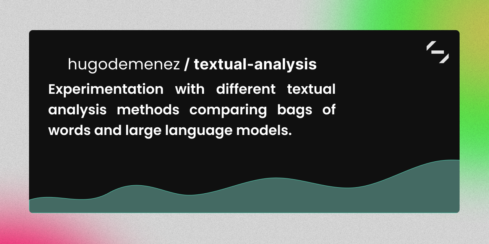

## Active repositories
|||
| ------------- | ------------- |
|[](https://github.com/hugodemenez/deltalytix)|[](https://github.com/SteinPrograms/base-python-architecture)|
|[](https://github.com/FinancialForecastingProject/PatternRecognitionStrategy.git)|[](https://github.com/hugodemenez/Python_Brokers_API)|
|[](https://github.com/hugodemenez/steinprograms-website)|[](https://github.com/hugodemenez/textual-analysis)|


## My Stats

<!--START_SECTION:waka-->
📅 **I'm Most Productive on Saturday** 

```text
Monday                   1726 commits        ███░░░░░░░░░░░░░░░░░░░░░░   11.66 % 
Tuesday                  2316 commits        ████░░░░░░░░░░░░░░░░░░░░░   15.65 % 
Wednesday                2205 commits        ████░░░░░░░░░░░░░░░░░░░░░   14.90 % 
Thursday                 2119 commits        ████░░░░░░░░░░░░░░░░░░░░░   14.32 % 
Friday                   2267 commits        ████░░░░░░░░░░░░░░░░░░░░░   15.32 % 
Saturday                 2423 commits        ████░░░░░░░░░░░░░░░░░░░░░   16.37 % 
Sunday                   1745 commits        ███░░░░░░░░░░░░░░░░░░░░░░   11.79 % 
```


📊 **This Week I Spent My Time On** 

```text
💬 Programming Languages: 
Python                   2 mins              █████████████████░░░░░░░░   66.23 % 
netrw                    0 secs              ██████░░░░░░░░░░░░░░░░░░░   23.88 % 
Bash                     0 secs              ██░░░░░░░░░░░░░░░░░░░░░░░   09.89 % 
```


 Last Updated on 05/03/2026 02:00:49 UTC
<!--END_SECTION:waka-->


