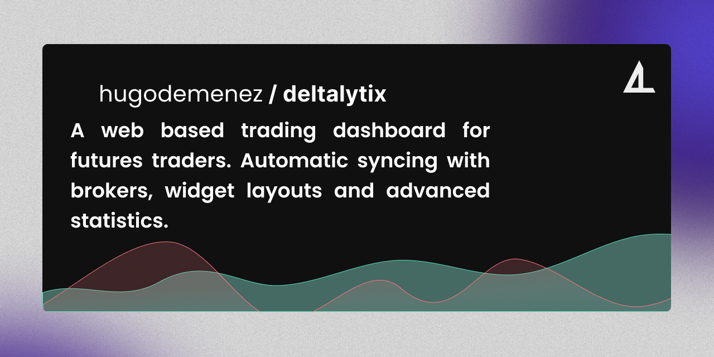
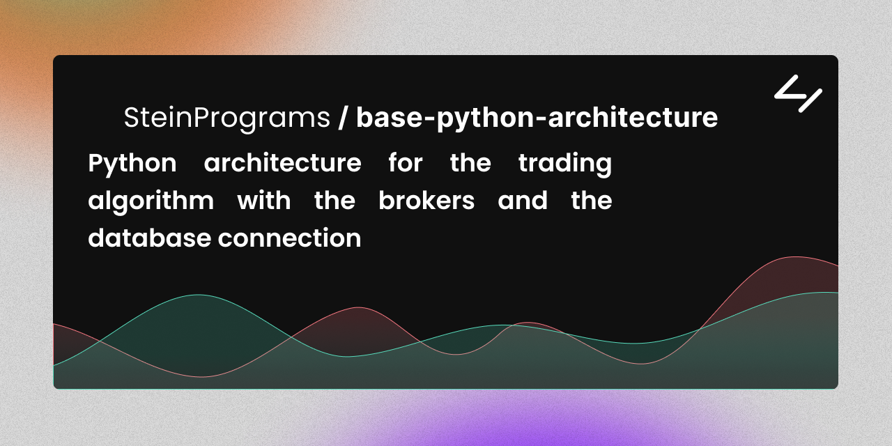
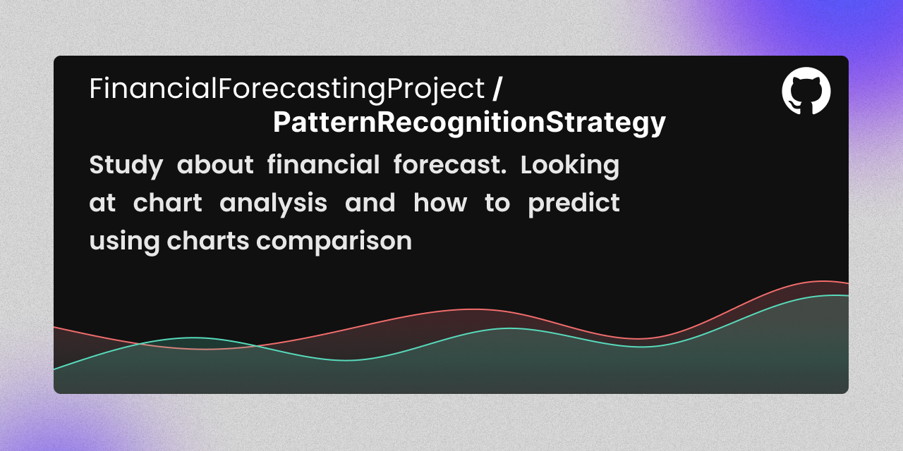
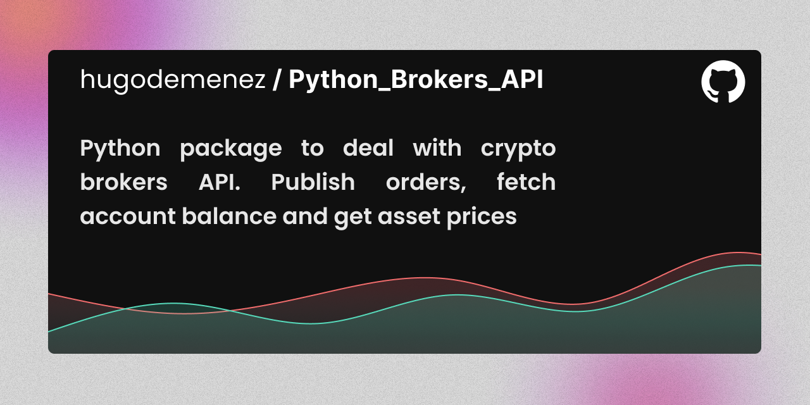
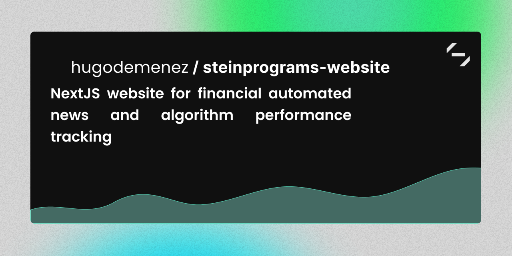
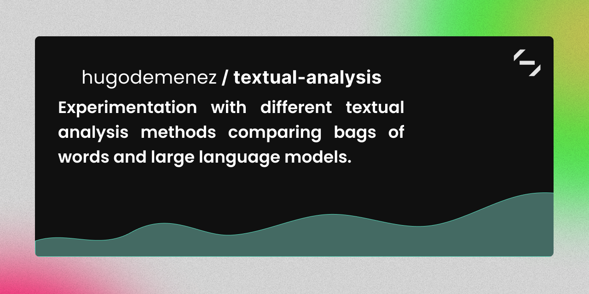

## Active repositories
|||
| ------------- | ------------- |
|[](https://github.com/hugodemenez/deltalytix)|[](https://github.com/SteinPrograms/base-python-architecture)|
|[](https://github.com/FinancialForecastingProject/PatternRecognitionStrategy.git)|[](https://github.com/hugodemenez/Python_Brokers_API)|
|[](https://github.com/hugodemenez/steinprograms-website)|[](https://github.com/hugodemenez/textual-analysis)|


## My Stats

<!--START_SECTION:waka-->


📅 **I'm Most Productive on Saturday** 

```text
Monday                   5445 commits        ███░░░░░░░░░░░░░░░░░░░░░░   11.27 % 
Tuesday                  7202 commits        ████░░░░░░░░░░░░░░░░░░░░░   14.91 % 
Wednesday                6295 commits        ███░░░░░░░░░░░░░░░░░░░░░░   13.03 % 
Thursday                 5852 commits        ███░░░░░░░░░░░░░░░░░░░░░░   12.12 % 
Friday                   7297 commits        ████░░░░░░░░░░░░░░░░░░░░░   15.11 % 
Saturday                 10059 commits       █████░░░░░░░░░░░░░░░░░░░░   20.83 % 
Sunday                   6144 commits        ███░░░░░░░░░░░░░░░░░░░░░░   12.72 % 
```


📊 **This Week I Spent My Time On** 

```text
💬 Programming Languages: 
TypeScript               3 hrs 11 mins       ███████░░░░░░░░░░░░░░░░░░   29.55 % 
JavaScript               2 hrs 43 mins       ██████░░░░░░░░░░░░░░░░░░░   25.23 % 
Markdown                 2 hrs 36 mins       ██████░░░░░░░░░░░░░░░░░░░   24.18 % 
Python                   36 mins             █░░░░░░░░░░░░░░░░░░░░░░░░   05.58 % 
CSS                      33 mins             █░░░░░░░░░░░░░░░░░░░░░░░░   05.13 % 
```

🤖 **AI Coding This Week** 

```text
⏱ AI Coding Time: 10 hrs 47 mins (99.73%)

✍️ 10,278 lines written by AI, 0 lines written by hand (100.0% AI-written)

🔤 340,846,422 Input Tokens, 1,018,394 Output Tokens

💵 $1483.10 Estimated AI Cost This Week

🧠 66 AI Sessions, 206 AI Prompts

GPT                      7,752 lines         ███████████████████░░░░░░   75.38 % 
Opus                     2,532 lines         ██████░░░░░░░░░░░░░░░░░░░   24.62 % 
Composer                 0 lines             ░░░░░░░░░░░░░░░░░░░░░░░░░   00.00 % 

🔎 AI Coding Insights:
🤖 AI-Driven — 100.0% of written lines came from AI
📚 Verbose Prompter — average 12,199 characters per prompt
🔁 Iterative Prompter — average 3 prompts per session
🚀 High AI Trust — 0.0% of changed lines were hand-edited
```


 Last Updated on 11/08/2026 01:45:08 UTC
<!--END_SECTION:waka-->


