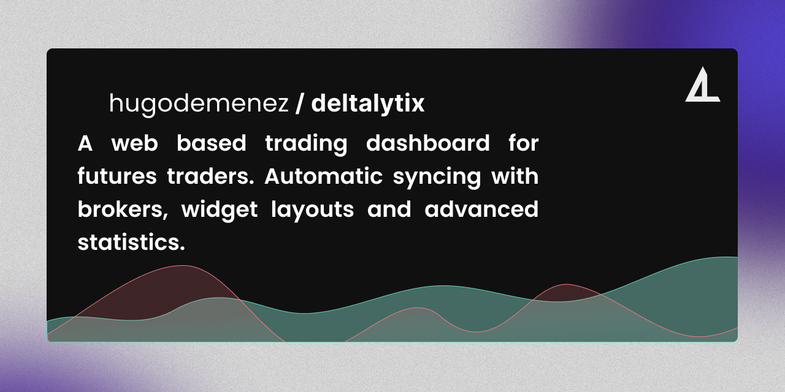
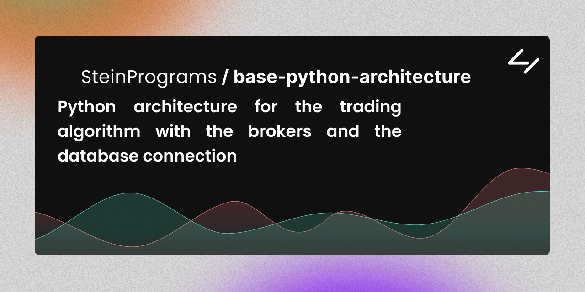
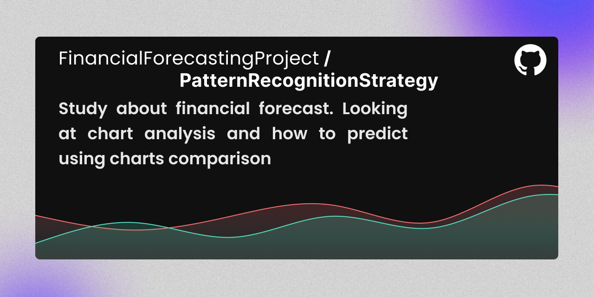
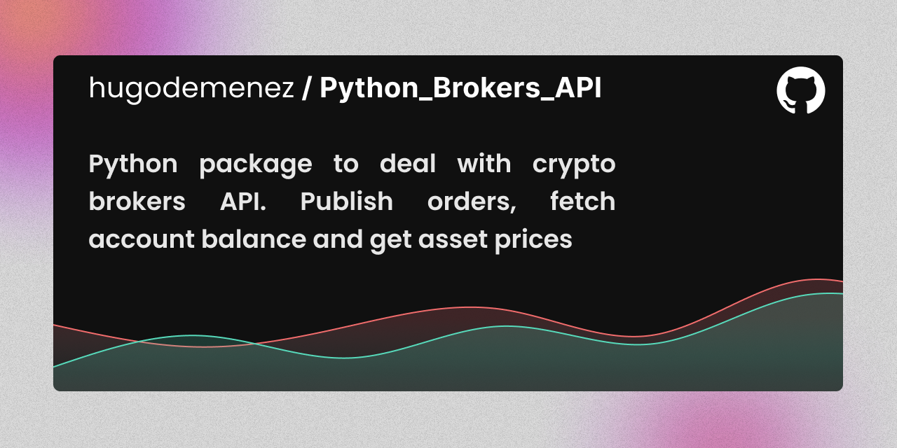
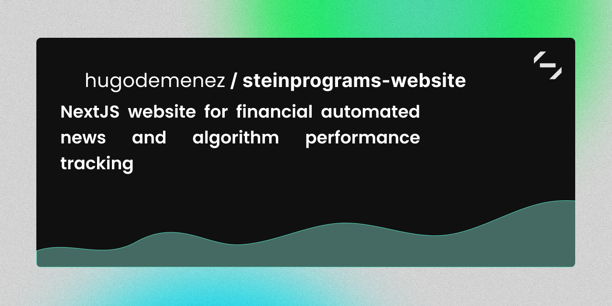
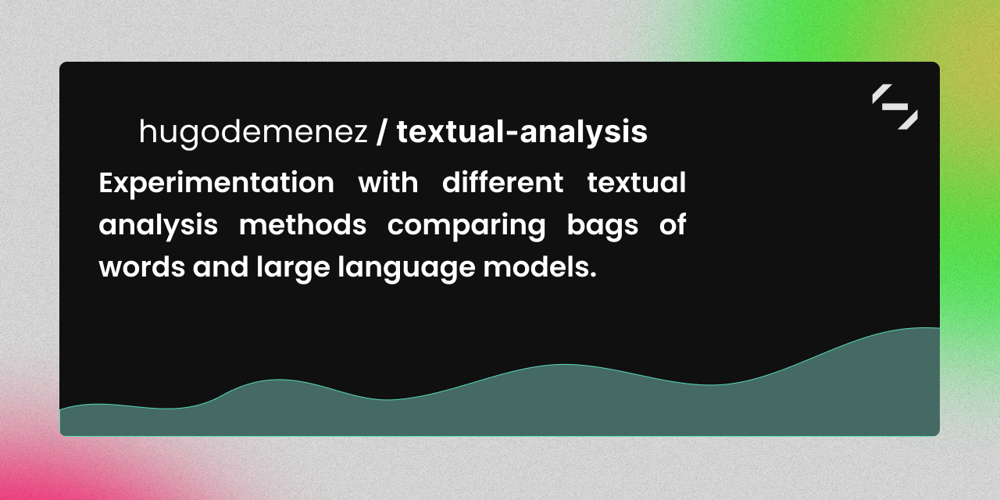

## Active repositories
|||
| ------------- | ------------- |
|[](https://github.com/hugodemenez/deltalytix)|[](https://github.com/SteinPrograms/base-python-architecture)|
|[](https://github.com/FinancialForecastingProject/PatternRecognitionStrategy.git)|[](https://github.com/hugodemenez/Python_Brokers_API)|
|[](https://github.com/hugodemenez/steinprograms-website)|[](https://github.com/hugodemenez/textual-analysis)|


## My Stats

<!--START_SECTION:waka-->


📅 **I'm Most Productive on Saturday** 

```text
Monday                   23177 commits       ███░░░░░░░░░░░░░░░░░░░░░░   11.11 % 
Tuesday                  29776 commits       ████░░░░░░░░░░░░░░░░░░░░░   14.28 % 
Wednesday                26799 commits       ███░░░░░░░░░░░░░░░░░░░░░░   12.85 % 
Thursday                 23619 commits       ███░░░░░░░░░░░░░░░░░░░░░░   11.33 % 
Friday                   31706 commits       ████░░░░░░░░░░░░░░░░░░░░░   15.21 % 
Saturday                 46278 commits       ██████░░░░░░░░░░░░░░░░░░░   22.19 % 
Sunday                   27168 commits       ███░░░░░░░░░░░░░░░░░░░░░░   13.03 % 
```


📊 **This Week I Spent My Time On** 

```text
💬 Programming Languages: 
No Activity Tracked This Week
```

🤖 **AI Coding This Week** 

```text
No AI Coding Activity Tracked This Week
```


 Last Updated on 07/10/2026 04:43:15 UTC
<!--END_SECTION:waka-->


